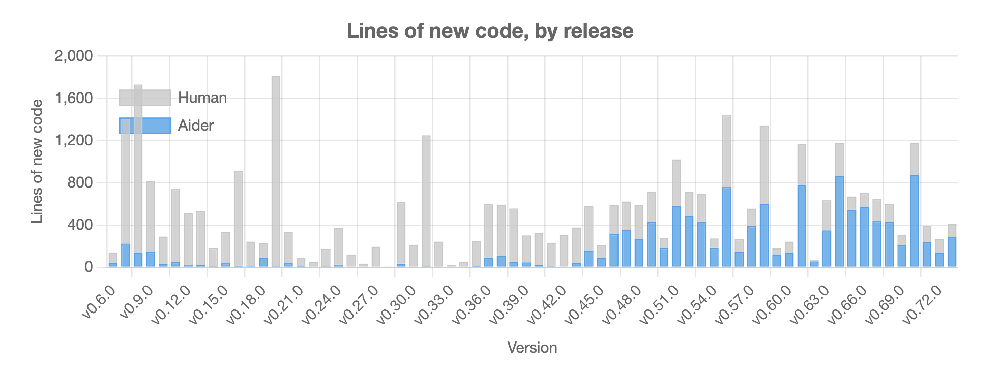
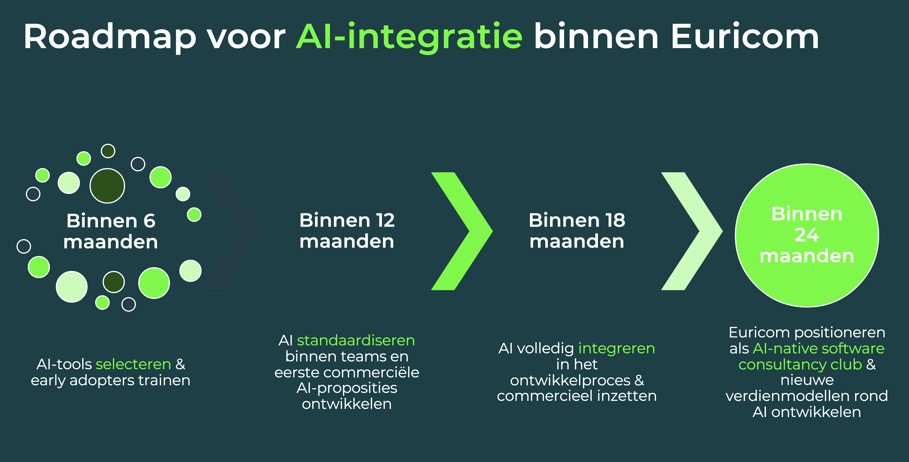
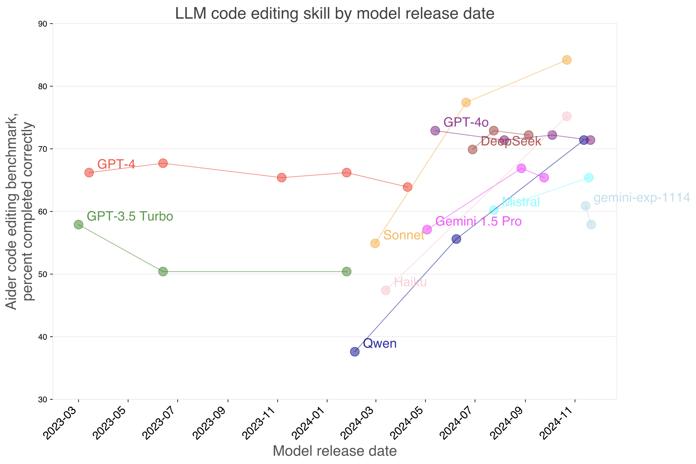
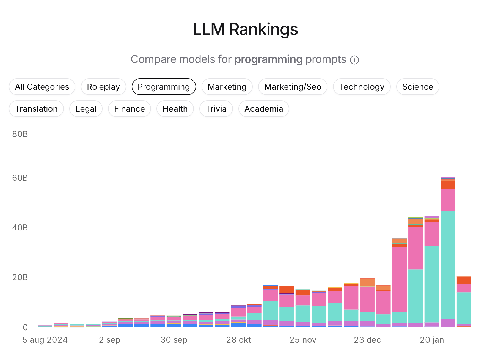
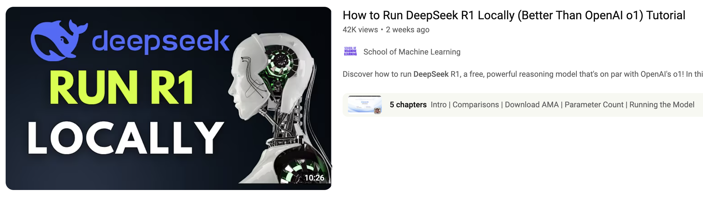
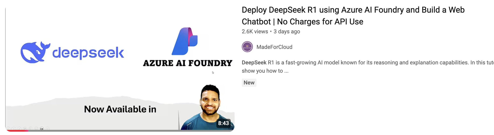
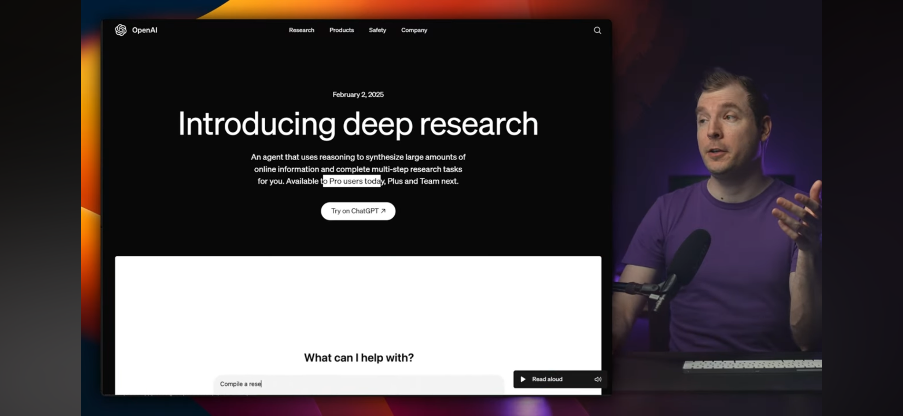

# AI Dev Tools


<br/><br/><br/><br/><br/>
<br/><br/><br/><br/><br/>

# Intelligent Explosion


<br/><br/><br/><br/><br/>
<br/><br/><br/><br/><br/>

# News in the marked


https://www.youtube.com/watch?v=vol1qJB2waE

Aider - Number lines of code generated by AI
https://aider.chat/HISTORY.html


<br/><br/><br/><br/><br/>
<br/><br/><br/><br/><br/>

# Euricom



<br/><br/><br/><br/><br/>
<br/><br/><br/><br/><br/>

# The best (programming) models

| Model                 | Input (1m) | Output (1m) | Remarks                     |
| --------------------- | ---------- | ----------- | --------------------------- |
| ChatGPT 4o            | $2.50      | $10.0       |                             |
| ChatGPT 4o-mini       | $0.15      | $0.60       |                             |
| ChatGPT o1            | $15.00     | $60.00      | Reasoning model             |
| **ChatGPT o3-mini**   | **$1.10**  | **$4.40**   | **Reasoning model**         |
| **Claude 3.5 Sonnet** | **$3.00**  | **$15.0**   |                             |
| Claude 3.5 Haiku      | $0.25      | $1.25       |                             |
| Claude 3.5 Opus       | $15.00     | $75         |                             |
| Deepseek V3           | $0.27      | $1.00       |                             |
| **Deepseek R1**       | **$0.55**  | **$2.19**   | **Reasoning model**         |
| ----                  |            |             |                             |
| DeepClaude            | -          | -           | Deepseek R1 + Claude Sonnet |

**Open AI**

https://platform.openai.com/

- GTP 4 (legacy)
- GTP 4o (great for most questions)
- **GPT 4o mini** (faster and cheaper for most questions)
- o1 (Uses advanced reasoning)
- o3-mini (Fast advanced reasoning)        <-> DeepSeek R1
- **o3-mini-high** (Great a coding and logic)  <-> Claude Sonnet 3.5

**Anthropic**

https://console.anthropic.com/

- **Claude Sonnet 3.5** (the most intelligent model in the family)
- Claude Opus 3.5  (writing and complex tasks that require deep analysis or reasoning)
- Claude Haiku 3.5 (is optimized for speed)

**Mistral**

https://console.mistral.ai/

- **Codestral Model** (auto compleye model, can be used in Continue via API Key)

**Open Router**

https://openrouter.ai/

- See models: https://openrouter.ai/models

## Leaderboard

### Aider benchmarks 
https://aider.chat/docs/leaderboards/edit.html




### OpenRouter LLM Ranking 
https://openrouter.ai/rankings/programming?view=trending




<br/><br/><br/><br/><br/>
<br/><br/><br/><br/><br/>

# What about DeepSeek

- Has a very good reasoning model
- It's open source
- Low cost

- Very bad privacy policy (chatbot)
- Almost no security (how to build a bomb?)
- Stolen data

<br/><br/><br/><br/><br/>
<br/><br/><br/><br/><br/>


Other:
- https://datanews.knack.be/nieuws/innovatie/ai-robotica/australie-verbiedt-overheidsdiensten-gebruik-ai-tool-deepseek/
- https://www.bndestem.nl/binnenland/ai-sensatie-in-de-ban-bij-onze-overheid-kabinet-verbiedt-ambtenaren-om-deepseek-te-gebruiken~a2c040ad/?referrer=https%3A%2F%2Fwww.google.com%2F
- 




Here is a table summarizing the memory and disk space requirements for running various DeepSeek models:

| **Model**          | **Parameters** | **RAM Needed** | **Disk Space**   |
| ------------------ | -------------- | -------------- | ---------------- |
| DeepSeek-LLM 7B    | 7 billion      | 64 GB          | ~140 GB          |
| DeepSeek-LLM 67B   | 67 billion     | 128 GB+        | ~500 GB          |
| DeepSeek V2 16B    | 16 billion     | 64 GB          | ~250 GB          |
| DeepSeek V2 236B   | 236 billion    | 128 GB+        | Hundreds of GB   |
| DeepSeek V2.5 236B | 236 billion    | 128 GB+        | Hundreds of GB   |
| DeepSeek V3 671B   | 671 billion    | 512 GB+        | Enterprise-level |
| DeepSeek R1 1.5B   | 1.5 billion    | 8 GB           | ~140 GB          |
| DeepSeek R1 8B     | 8 billion      | 16 GB          | ~140 GB          |
| DeepSeek R1 14B    | 14 billion     | 32 GB          | ~250 GB          |




<br/><br/><br/><br/><br/>
<br/><br/><br/><br/><br/>

# Lets talk to the AI (ChatBots)

Commons

- https://chatgpt.com/ ($20/month)
- https://claude.ai/  ($18/month)
- https://www.perplexity.ai/ ($20/month)

Other

- https://copilot.microsoft.com/chats ($20/month)
- https://groq.com/ (very fast, open source models)

Chinsese

- https://chat.deepseek.com/
- https://chat.qwenlm.ai/ (from Alibaba)

Combined providers

- https://t3.chat/chat (super fast chatbot, alternative to chatgpt & claude)
- https://boxchat.ai/

Open Source (you need API keys)

- https://www.chatbotui.com
- https://www.librechat.ai 

Euricom
  
- https://euricom-librachat.hf.space 
  - Hosted by euricom with full access to open ai models
  - additional models via API keys (**Anthropic**, Mistral, **OpenRouter**, github, etc)
  
<br/><br/><br/><br/><br/>
<br/><br/><br/><br/><br/>

# Lets develop with the AI

## Tools (best of...)

IDE

- [Cursor](https://www.cursor.com/)
- [Windsurf](https://codeium.com/windsurf)
- [Zed](https://zed.dev/)

VSCode Extensions

- [GitHub CoPilot](https://github.com/features/copilot)  (auto complete + chat, €20)
- [Cline](https://github.com/cline/cline) (plan, act, API Keys)
- [RooCode](https://github.com/RooVetGit/Roo-Code) (code, architect, ask, API Keys)
- [Continue](https://docs.continue.dev) (auto complete + chat, API Keys)
- [SuperMaven](https://supermaven.com/) (fast auto complete, free + $10)

Jetbrean Extension

- [JetBrean AI Assistant](https://www.jetbrains.com/ai/) (chat, auto complete, €16)
- [Continue](https://docs.continue.dev) (auto complete + chat, API Keys)
- [SuperMaven](https://supermaven.com/) (fast auto complete)

Terminal

- [Aider](https://aider.chat/) (chat, code, API Keys)

UI

- [V0](https://v0.dev/chat) (UI to Code, free + $20)
- [RapidPages](https://github.com/rapidpages/rapidpages) (self host + API Keys)

App Builders

- [Replit Agent](https://replit.com/)
- [Bolt.new](https://bolt.new/)
- [Bolt diy](https://github.com/stackblitz-labs/bolt.diy)  (fork of Bolt.new)
- https://lovable.dev/
- https://srcbook.com/
- https://screenshottocode.com/
- https://databutton.com/
- https://www.tempolabs.ai/

**My favorites (for now)**

Option 1:
- Cursor - $20
- ChatGPT / Claude / LibraChat for chat
- Perplexity for research

Option 2:
- Euricom API Keys for OpenAI, Anthropic & OpenRouter
- RooCode for architecture & code
- LibraChat for chat
- SuperMaven for fast auto complete

Option 3 (Jetbrean)
- Euricom API Keys for OpenAI, Anthropic & OpenRouter
- Continue Dev for coding
- SuperMaven for fast auto complete
- LibraChat for chat

Option 4 (Visual Studio - .NET)
- Euricom API Keys for OpenAI, Anthropic & OpenRouter
- CoPilot for auto complete & basic edit
- LibraChat for chat
- Aider for architecture & code

## Set the rules

Rules are custom instructions that guide the AI assistant in Cursor, tailoring its behavior when interpreting code, generating suggestions, and responding to queries.
https://www.youtube.com/watch?v=aG-utUqVrb0

Create your rules file

```
copilot: .github/copilot-instructions
Cursor: .cursorrules
winsurf: .windsurfrules
aider: conventions.md
```

Global Rules

```
1. Bug Fixes:
   - Analyze the problem thoroughly before suggesting fixes
   - Provide precise, targeted solutions
   - Explain the root cause of the bug

2. Keep It Simple:
   - Prioritize readability and maintainability
   - Avoid over-engineering solutions
   - Use standard libraries and patterns when possible

3. Code Changes:
   - Propose a clear plan before making changes
   - Apply all modifications to a single file at once
   - Do not alter unrelated files

Remember to always consider the context and specific requirements of each project.
```

Project Rules

```
You are an expert in TypeScript, Node.js, Next.js App Router, React, Shadcn UI, Radix UI and Tailwind.

# Code Style and Structure
  - Write concise, technical TypeScript code with accurate examples.
  - Use functional and declarative programming patterns; avoid classes.
  - Prefer iteration and modularization over code duplication.
  - Use descriptive variable names with auxiliary verbs (e.g., isLoading, hasError).
  - Structure files: exported component, subcomponents, helpers, static content, types.

# Naming Conventions
  - Use lowercase with dashes for directories (e.g., components/auth-wizard).
  - Favor named exports for components.
  
# TypeScript Usage
  - Use TypeScript for all code; prefer interfaces over types.
  - Avoid enums; use maps instead.
  - Use functional components with TypeScript interfaces.
  
# Syntax and Formatting
  - Use the "function" keyword for pure functions.
  - Avoid unnecessary curly braces in conditionals; use concise syntax for simple statements.
  - Use declarative JSX.
  
# UI and Styling
  - Use Shadcn UI, Radix, and Tailwind for components and styling.
  - Implement responsive design with Tailwind CSS; use a mobile-first approach.
  
# Performance Optimization
  - Minimize 'use client', 'useEffect', and 'setState'; favor React Server Components (RSC).
  - Wrap client components in Suspense with fallback.
  - Use dynamic loading for non-critical components.
  - Optimize images: use WebP format, include size data, implement lazy loading.
  
#  Key Conventions
  - Use 'nuqs' for URL search parameter state management.
  - Optimize Web Vitals (LCP, CLS, FID).
  - Limit 'use client':
    - Favor server components and Next.js SSR.
    - Use only for Web API access in small components.
    - Avoid for data fetching or state management.
  
  Follow Next.js docs for Data Fetching, Rendering, and Routing.
```

<br/><br/><br/><br/><br/>
<br/><br/><br/><br/><br/>

## Efficiently build applications with AI

**Phase 1 - Brain dump**

Helps you define the overall structure and purpose of your app. By answering key questions, you'll generate a masterplan.md file, which serves as a blueprint for the entire project.

- Create you wireframes

  - [Balsamic](https://balsamiq.com/) 
  - [Figma](https://www.figma.com/)
  - [Eraser](https://www.eraser.io/)
  - [Excalidraw](https://excalidraw.com/)
  - [TLDraw](https://www.tldraw.com/)

- Create a brain dump of all the requirement of the application/module
- Using Chat (ChatGPT, Claude, LibraChat)
- Generate large text how the application works: **The Master Plan**
- During discussion with AI, insert wireframes
- TIP: Try to use speech to text to be more efficient.

[Masterplan Template](./plan&execute/masterplan.md)

**Phase 2 - Stub Out Project**

After defining your app’s structure, sub out the project by creating a skeleton of your project. This phase focuses on setting up the basic architecture and stubbing out essential components, leaving placeholders for further development.

- Using Chat (Claude, LibraChat)
- Using Cursor (or other)
- Using v0.dev (Component, Pages)
- Generate folder structure & basic files

[Stub Out Project Template](./plan&execute/stub-out-project.md)

**Phase 3 - Functionality**

This will guide you in transforming the stubbed-out project from Phase 2 into fully functional, production-ready code. You'll focus on implementing core features, building out your app, and making sure everything is well-structured and scalable.

- Using Cursor (or other)
- Glue all together
- Fix bugs & cleanup
- Done

[Fully Code Out Implementation Template](./plan&execute/code-out-implementation.md)

**See more:** 

- [Claude 3.5 Crash Course for Developers](https://www.youtube.com/watch?v=fMa2zQIkQwM)
- https://github.com/bhancockio/claude-crash-course-templates

<br/><br/><br/><br/><br/>
<br/><br/><br/><br/><br/>

## Additional Tutorials / Articles

Cursor Awesome Rules
- https://github.com/PatrickJS/awesome-cursorrules

Rule Tutorials
- [Cursor + Windsurf Settings to 5x AI's Output Quality](https://www.youtube.com/watch?v=aG-utUqVrb0)
- [Customizing AI Behavior for Personalized Coding](https://cursor101.com/article/cursor-rules-customizing-ai-behavior)

Github CoPilot
- [Using Custom Instructions with Copilot to enhance our prompts](https://www.youtube.com/watch?v=cu9zZAFmoDg)

Cursor
- [Video Tutorials](https://cursor101.com/video)
- [Articles](https://cursor101.com/article)

WindSurf
- [I'm Addicted to Windsurf, Send Help](https://www.youtube.com/watch?v=ukhe1013Jpk)

<br/><br/><br/><br/><br/>
<br/><br/><br/><br/><br/>


# What's next'

**OpenAI's New LEAKED Coding Tool: The End Of Software Engineers**


https://www.youtube.com/watch?v=pzgjYW3msKg&t=914s


**Openai Deep Research**




<br/><br/><br/><br/><br/>
<br/><br/><br/><br/><br/>

## Start your AI journey

- Get the API keys
- Install RooCode / Supermaven
- Try code challenges
  - See prompts.md
  - Your own challange (API, UI, App, ...)
  - Your own project
- Create a masterplan.md
- ...
  
## Training

- [Youtube - aiwithbrandon](https://www.youtube.com/@bhancock_ai)
- [Productive Developer Workflows with AI Enhanced Cursor IDE](https://egghead.io/courses/productive-developer-workflows-with-ai-enhanced-cursor-ide-a1c02522)
- [Youtube - The AI Advantage](https://www.youtube.com/@aiadvantage)
- [Skill Leap AI](https://www.youtube.com/@aiadvantage)
- [Prompt Engineering Tutorials](https://lawtonsolutions.com/How-To-AI/)

## Addendum

- [GitHub Copilot vs Cursor AI: The Best AI Coding Assistant for Developers](https://pixicstudio.medium.com/github-copilot-vs-cursor-ai-fbe229e20629)
- [Windsurf VS Cursor - Detailed Comparison & Coding CHALLENGE](https://www.youtube.com/watch?v=GU-QDyZDX2o)
- [Cursor + Windsurf Settings to 5x AI's Output Quality (Works with VS Code too)](https://www.youtube.com/watch?v=aG-utUqVrb0)
- [Why leave GitHub Copilot Behind?](https://cursor101.com/tutorial/learn-cursor-0-why-use-cursor)
- [I tested DeepSeek vs. o3-mini for developers: Here’s what I found.](https://www.youtube.com/watch?v=KoTI8_4epTw)
- [I spent 400+ hours in Cursor, here’s what I learned](https://www.youtube.com/watch?v=gYLNxUxVomY)
- [How to Build a NextJS MVP using v0, Claude, and Cursor](https://www.youtube.com/watch?v=2qU3SPPojDA)